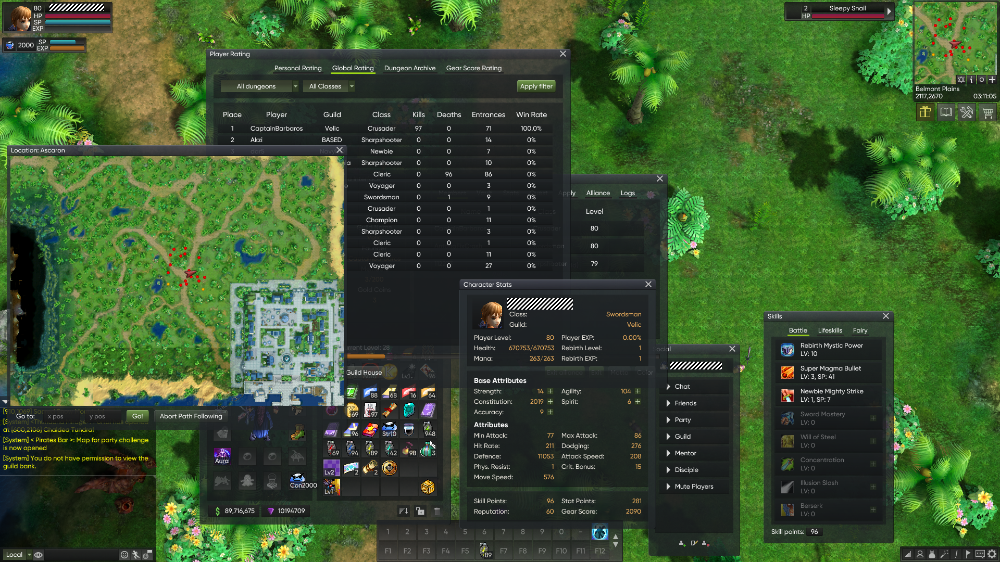
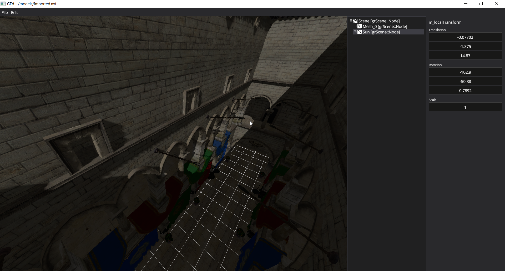

# GroveEngine 2
The predecessor to [Winterkit](https://micodev.net/winterkit). **This repository is not going to be maintained further, as the further development will be focused on *Winterkit*.**

The project in this repository is licensed under **GNU General Public License, Version 3.0**. If you need a different license, contact me at `deltacxxw at gmail dot com`.

Contains a lot of stuff, but the main point of interest (and the most mature part of this project) is the **UI framework**.

## Screenshots

*[Kraken Online](https://kraken-online.org/) uses the GUI framework from here.*

*Among other things, a simple 3D engine is included in this project.*

## Directory structure
- `enginedata` – resources internal to the framework.
- `editordata` – resources internal to the scene editor.
- `frameworks/grApplication` – startup code for standalone graphical applications using grUi.
- `frameworks/grDX11` – D3D11 renderer backend.
- `frameworks/grEngine` – various code related to the core event loop.
- `frameworks/grGitRevision` – scripts to generate Git revision headers.
- `frameworks/grImg` – image loading API.
- `frameworks/grMain` – startup code for console applications.
- `frameworks/grRenderCore` – HAL interfaces for the renderer.
- `frameworks/grRenderView` – rendering frontend for the 3D engine.
- `frameworks/grScene` – scene representation for the 3D engine.
- `frameworks/grUi` – core GUI framework.
- `frameworks/grUiNative` – GUI framework extensions for desktop applications.
- `frameworks/gtl` – the **core library** for the framework, including core types, VFS, asset management etc.
- `frameworks/gtlMath2` – the math library used in here.
- `frameworks/gtlTestLib` – unit-testing utils for those few unit tests that are here.
- `tools/bmfg` – temporarily ad-hoc utility to convert bitmap fonts.
- `tools/ged` – scene and asset editor for the 3D engine. Severely unfinished, but some features work.
- `tools/gpkpack` – command-line utility to build *.gpk asset archives.
- `tools/textool` – command-line utility to convert textures into the internal `*.nxf` format.

## Known issues with the UI engine
Do note that a lot of these issues **have been or will be resolved in Winterkit**.
- Documentation is non-existent. You're on your own.
- While UI is optimized to handle thousands of widgets in the scene, the performance could be improved further with better batching etc.
- UI layout engine has some issues in various corner-cases related to content bias.
- No WYSIWYG UI editor or any sort of declarative UI language :(
- No custom allocator support.

## Other known issues
- 3D engine is very incomplete.
